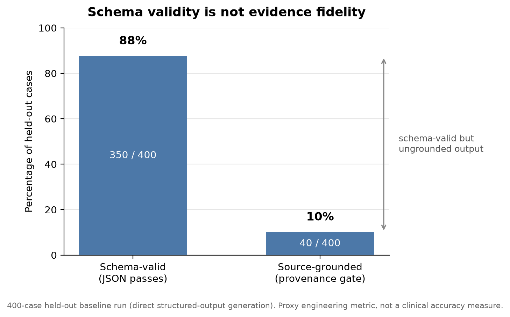
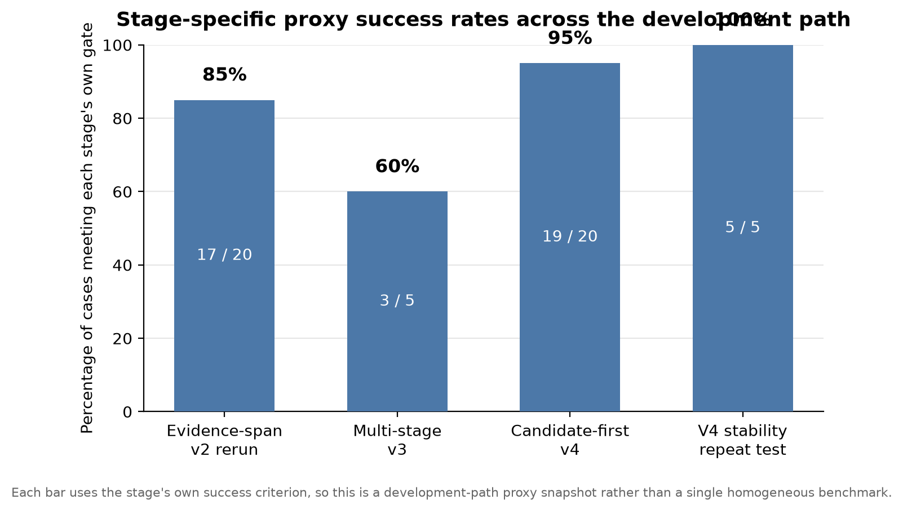
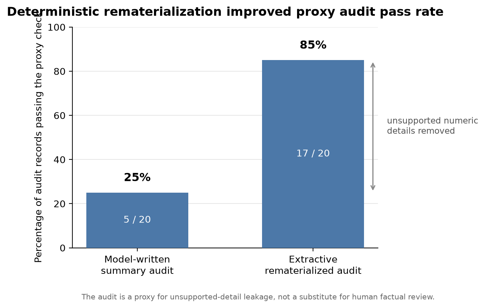

# HandoffLens

HandoffLens is a research and engineering project for source-grounded information extraction from hospital discharge-summary-style text. It asks a practical reliability question:

> How do you make an LLM extraction system prove where its claims came from, and fail visibly when it cannot?

The project is aimed at engineers and data scientists building LLM systems over long, messy, high-stakes documents. It is a portfolio/research artifact, not a medical product.

This repository is my independent work. It does not represent the views, strategies, or endorsement of Cohere or any other model provider.

## The result

Structured output is not the same thing as grounded output.

In a 400-case engineering run, roughly 88% of baseline LLM outputs passed JSON schema validation, but only about 10% survived an exact-source provenance check. The baseline produced 5,467 generated quotations that could not be found verbatim in the source text.

That low provenance pass rate is the finding: valid-looking structured output can still be ungrounded.

HandoffLens responds with a candidate-first architecture. Instead of asking the model to freely extract and summarize, the system:

1. deterministically identifies source candidates;
2. preserves exact source quotations and stable identifiers;
3. asks the model to classify ambiguous candidates;
4. applies deterministic provenance and consistency gates;
5. abstains when evidence is insufficient;
6. materializes final labels and summaries only from accepted evidence.

In the fresh June 23 validation rerun, candidate-first v4 passed the deterministic provenance gate on 19 of 20 development cases, with one principled abstention. The remaining open question is whether its higher item count reflects recovered evidence or over-extraction; that is prepared for factual review.

## Start here

For a quick review, these are the most useful files:

1. [Scientific Write-up](docs/SCIENTIFIC_WRITEUP.md) - full problem framing, architecture, and references.
2. [Final Validation Snapshot](docs/FINAL_VALIDATION_2026_06_23.md) - fresh rerun, stability checks, source-fidelity audit, and review-packet status.
3. [Project Status](docs/PROJECT_STATUS.md) - what is complete, pending, and unsupported.
4. [Claims Register](docs/claims-register.md) - what each result does and does not justify.
5. [Handoff Atoms Design](docs/handoff-atoms-design.md) - atom-first extraction, typed safety flags, and deterministic atom/view canonicalization.
6. [Conformal and Selective-Routing Work](docs/conformal-routing-ongoing.md) - ongoing proxy-risk routing work and how to interpret it.
7. [Benchmark Close-Out Plan](docs/benchmark-closeout-plan.md) - final public approach for external benchmark completion.
8. [Records Adapter Contract](docs/records-adapter-contract.md) - dataset adapter input schema and publishing rules.
9. [Public Benchmark Run Results](docs/public-benchmark-results-2026-07-21.md) - first ACI/BioScope public benchmark execution.

## What is included

This public repository contains:

- deterministic provenance gates and validation checks;
- candidate-first extraction and evidence-indexing code;
- structured-output schemas and prompt variants;
- a browser-only synthetic demo;
- aggregate validation summaries;
- source-fidelity and review-packet tooling;
- ongoing selective-routing/conformal experiments using proxy labels;
- config-driven extraction profiles for discharge summaries and dialogue-like records;
- a benchmark manifest scaffold that blocks unsupported public benchmark claims;
- ACI-Bench and BioScope public benchmark adapters/scorers that refuse unsupported headline results.

It does not contain source clinical records, private cohorts, case-level private outputs, reviewer packets, API keys, or completed human annotations.

## Demo

The browser demo is intentionally small and safe: it is a deterministic baseline extractor running on synthetic text, with no network calls and no API key.

It also includes precomputed synthetic pipeline snapshots that illustrate the full system behavior:

- accepted evidence with an attached source quote;
- structured abstention when source support is insufficient;
- an audit failure showing why generated summaries need source-fidelity checks.

The full LLM/provenance pipeline is represented in the validation reports and can be run locally only with private inputs and API credentials.

## Docker

The public artifact is containerized for both the static demo and reproducible validation.

```bash
docker compose --profile demo up --build
docker compose --profile eval run --rm eval
docker compose --profile benchmark run --rm benchmark
```

- `demo` serves the browser-only synthetic demo at `http://localhost:8080`.
- `eval` builds a clean Node validation image and runs `npm run check:all` without local result mounts.
- `benchmark` runs the public benchmark unit path and can mount ignored local benchmark/output directories.

External benchmark files should be placed under the ignored local `benchmark_data/` directory and mounted read-only at `/benchmarks`. For example, after placing BioScope XML files under `benchmark_data/bioscope/`, run:

```bash
docker compose --profile benchmark run --rm benchmark npm run benchmark:bioscope:conformal -- --input "/benchmarks/bioscope/abstracts.xml;/benchmarks/bioscope/full_papers.xml" --alpha 0.10 --out results/bioscope-conformal-public-text.json
```

The Docker image does not copy `.env`, raw clinical data, benchmark corpora, generated samples, or `results/`.

## Validation summary

| Component | Status | Interpretation |
| --- | --- | --- |
| Structured-output baseline | Completed | High schema validity, poor exact-source provenance |
| Candidate-first v4 | Strongest current architecture | 19/20 deterministic-gate pass on fresh rerun; one abstention |
| Extractive rematerialization | Added after audit | Removed unsupported numeric details from model-written summaries |
| Stability testing | Completed on development subset | Passed gates; ambiguous candidate selection is not perfectly repeatable |
| Source-fidelity review packets | Prepared | Human factual review is pending |
| Handoff atoms and safety typing | Added | Repairs atom/category projection failures and exposes typed safety misses |
| Conformal/selective routing | Ongoing appendix | Uses proxy labels for escalation-policy research, not clinical safety |
| Benchmark/profile close-out | Public benchmark path added | ACI public JSON ingestion and note-shape diagnostics are reported; BioScope assertion and conformal results are reported; no clinical-performance claim is made |

The public figure set is reproducible from `eval/public_results_summary.json` by running `python3 scripts/make-results-figure.py` after `python3 -m pip install -r requirements.txt`.





## What this does not claim

HandoffLens does not claim clinical accuracy, clinical safety, harmful-error reduction, deployment readiness, patient outcome improvement, or generalization to external hospitals.

The evidence supports engineering claims about schema reliability, source provenance, abstention behavior, stability, cost/latency, and review readiness. Clinical claims would require independent factual labels, qualified clinical review, and external validation.

## Repository map

- `scripts/` - evaluation, gating, routing, review, and analysis programs
- `prompts/` - prompt variants and extraction instructions
- `eval/` - public schemas, rubrics, manifests, and synthetic fixtures
- `profiles/` - note-type/domain profiles used by candidate-first extraction
- `docs/` - scientific write-up, validation snapshot, status, claims, and appendix material
- `benchmark_data/` - ignored local mount point for externally downloaded public benchmark files
- `app.js`, `index.html`, `styles.css` - static synthetic demo
- `review.*` - local blinded-review interface
- `MODEL_CARD.md` - intended use, non-use, and limitations

## License

Portfolio and research demonstration. Not licensed for reuse or redistribution.

