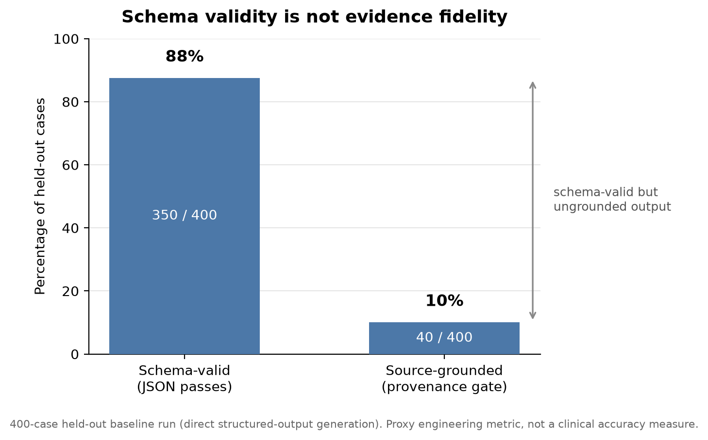
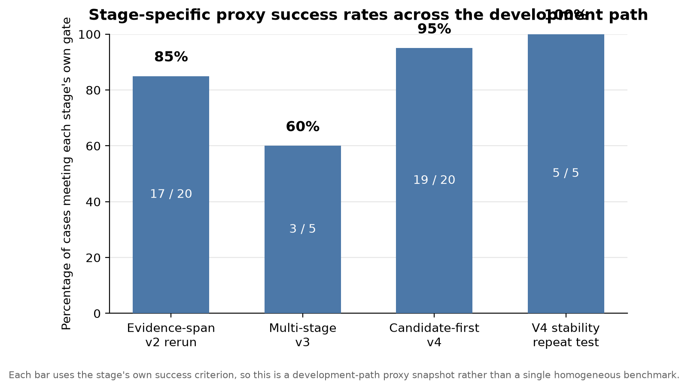
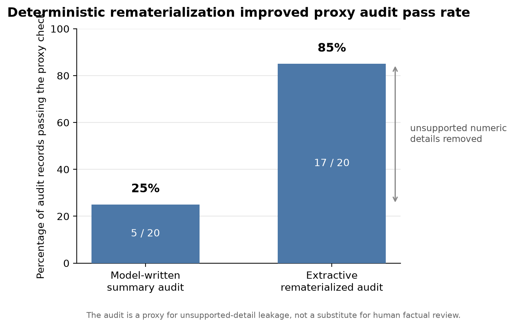

# HandoffLens

HandoffLens is a research and engineering project for source-grounded information extraction from hospital discharge-summary-style text. It asks a practical reliability question:

> How do you make an LLM extraction system prove where its claims came from, and fail visibly when it cannot?

The project is aimed at engineers and data scientists building LLM systems over long, messy, high-stakes documents. It is a portfolio/research artifact, not a medical product.

This repository is my independent work. It does not represent the views, strategies, or endorsement of Cohere or any other model provider.

## The result

Structured output is not the same thing as grounded output.

The current public benchmark result is a 207-row ACI-Bench note-generation run with Command A+ plus a deterministic attribution-repair diagnostic:

| Run | Rows | ROUGE-L F1 | Source-token support | Cases with unsupported sentences | Mean output tokens |
| --- | ---: | ---: | ---: | ---: | ---: |
| Command A+ generated notes | 207 | 0.2550 | 0.6945 | 100.0% | 250.6 |
| `compact_extractive` attribution repair | 207 | 0.2324 | 1.0000 | 24.6% | 435.9 |

The selected repair keeps 91.2% of the raw Command A+ ROUGE-L score while reducing unsupported-sentence case rate by 75.4 percentage points. The tradeoff is output length: repaired notes are 73.9% longer on average. The 1.0000 lexical support score is expected by construction because the repair emits source-dialogue spans; it is a useful gate diagnostic, not proof of semantic factuality.

Two caveats matter. First, this `0.2550` ROUGE-L result is a reproduced public-JSON diagnostic, not an official ACI-Bench leaderboard submission; it should not be compared directly to published full-note scores without matching the official scorer, preprocessing, and split protocol. Second, `compact_extractive` is treated as a pre-specified repair policy. The four-method repair table is an ablation over the reported rows, not a same-row winner-selection proof.

Earlier development runs explain why this matters. In a 400-case engineering run, roughly 88% of baseline LLM outputs passed JSON schema validation, but only a small minority survived an exact-source provenance check. The selected JSON-schema cell produced 5,467 generated `source_quote` strings that could not be found verbatim in the source text.

That number is not a hallucination rate. A follow-up miss-taxonomy and span-ID recovery pass separates exact-match failures into normalization/punctuation artifacts, non-contiguous quotations, likely pointer drift, label-supported unresolved quotes, weak-overlap review cases, and low-overlap possible fabrication cases. On the selected JSON-schema cell, deterministic span recovery raises item-level auditable support from 54.4% exact-contiguous quotes to 82.9% span-supported items, but 2,053 items still abstain and only 31 of 350 completed records fully pass the span-support gate. The defensible finding is narrower and more useful for system design: schema validity carried little information about whether an extracted field had an auditable source anchor. A pipeline gated only on structure would have shipped with almost no visibility into source grounding.

A targeted decomposition stress test then selected the 200 lowest exact-provenance evidence items from each of three held-out Cohere cells and compared five parsing policies. Across 600 deliberately difficult items, exact full-note matching supported 0/600, normalized full-note matching supported 39/600, simple line-span retrieval supported 113/600, section-filtered retrieval supported 86/600, and assertion-guarded clause-aware query retrieval supported 395/600. A coherence audit then split those 395 supported items into 238 auto-accepted supports and 157 review-required supports; 205/600 items abstained, and 0 high-risk supported items remained. The latest revision adds target-aware assertion-cue scope checks plus a strict low-overlap review rescue. The tradeoff is that the low-overlap rescue adds only 3 supported items in the expanded run, all review-required. Normalized full-note support consumed about 1,662 source words when it succeeded, while line-span and query-aware retrieval used about 9.1 and 21.5 words respectively. This supports a parsing/chunking experiment for dense notes, but it does not prove that length causes failure or that retrieval fixes semantic errors.

The same policy was then run across the full available failed-exact-provenance pool from those three cells. Across 13,038 items, query-aware retrieval supported 11,001 items, with 7,829 auto-accepted, 3,172 review-required, 2,037 abstained, and 0 high-risk supported after a stricter label-only risk guard converted 332 diffuse label-only unions into abstentions. This broader pool includes easier exact-match failures than the 600-item hard slice, so it is useful as a scaling check, not a replacement for the harder stress result.

A model-side hard-case diagnostic then reran Command A+ on 20 private dense/low-performing cases across four full-note request modes plus candidate-first v4. JSON-schema full-note extraction completed 16/20 cases but only 2/16 completed cases passed the exact/span provenance gate; plain JSON completed 0/20, strict tools 4/20, and flat tools 6/20. Candidate-first v4 completed and passed deterministic gates on 20/20 cases with 716 exact source-backed evidence items. This is the strongest design signal for parsing/chunking, but the 1.000 exact support is by construction because candidate-first materializes accepted source candidates; it is not proof of semantic completeness or clinical correctness.

A cross-provider span-ID v5 ablation then tested whether generated free-text quotes should be replaced with constrained source-span IDs. On the same 20 hard cases, run three times per cell, Cohere Command A+ improved from 769/1192 supported quote-v2 items, 64.5%, to 1127/1276 supported span-ID-v5 items, 88.3%; the minimal selector reached 1131/1192, 94.9%, on quote-v2 and 1185/1276, 92.9%, on span-ID-v5. Anthropic Claude Haiku 4.5 showed the opposite provider interaction: quote-v2 was already high at 1709/1825, 93.6%, while raw span-ID-v5 fell to 1453/2168, 67.0%, mainly because it over-selected evidence spans after hosted-provider schemas stripped the local max-3 cap. Resolvable span IDs were 100% for successful span-ID runs because IDs came from provider-side enums; full v5 contract validity was lower, 52.8% for Haiku and 86.4% for Cohere, and that is the more honest design constraint.

The latest implementation response targets the case-gate arithmetic behind those results. Candidate-first materialization now records deterministic source candidate IDs, source offsets, and conservative near-duplicate evidence removal. The provenance taxonomy reports mean/median item count, the effective item count implied by item-level versus case-level pass rates, case-gate outcomes by item-count bucket, and a separate auditable-or-review-routed diagnostic. The decomposition stress runner also reports span-budget curves for lexical top-k matching and a transparent reranker-style matcher. These diagnostics do not weaken the strict gate: low-overlap possible-fabrication items still fail rather than being counted as clean abstentions.

HandoffLens responds with a candidate-first architecture. Instead of asking the model to freely extract and summarize, the system:

1. deterministically identifies source candidates;
2. preserves exact source quotations and stable identifiers;
3. asks the model to classify ambiguous candidates;
4. applies deterministic provenance and consistency gates;
5. abstains when evidence is insufficient;
6. materializes final labels and summaries only from accepted evidence.

In the fresh June 23 validation rerun, candidate-first v4 passed the deterministic provenance gate on 19 of 20 development cases, with one principled abstention. The remaining open question is whether its higher item count reflects recovered evidence or over-extraction; that is prepared for factual review.

## Start here

For a quick review, these are the most useful files:

1. [Public Benchmark Run Results](docs/public-benchmark-results-2026-07-21.md) - ACI-Bench, attribution repair, BioScope assertion runs, and explicit non-claims.
2. [Scientific Write-up](docs/SCIENTIFIC_WRITEUP.md) - problem framing, architecture, findings, and limitations.
3. [Claims Register](docs/claims-register.md) - allowed and prohibited interpretations.
4. [Reproducibility](docs/REPRODUCIBILITY.md) - commands, private-input boundaries, and artifact handling.
5. [Benchmark Adapter and Scoring](docs/benchmark-adapter-scoring.md) - ACI adapter, scoring, source-support proxies, and BioScope runners.
6. [Records Adapter Contract](docs/records-adapter-contract.md) - dataset adapter input schema and publishing rules.
7. [Model Card](MODEL_CARD.md) - intended use, non-use, and limitations.

## What is included

This public repository contains:

- deterministic provenance gates and validation checks;
- candidate-first extraction and evidence-indexing code;
- structured-output schemas and prompt variants;
- a browser-only synthetic demo;
- aggregate validation summaries;
- source-fidelity and review-packet tooling;
- archived selective-routing/conformal experiments using proxy labels;
- config-driven extraction profiles for discharge summaries and dialogue-like records;
- a benchmark manifest scaffold that blocks unsupported public benchmark claims;
- ACI-Bench and BioScope public benchmark adapters/scorers, including ACI extractive note baselines, Command A+ note evaluation, attribution repair diagnostics, source-support proxies, BioScope same-task baselines, and explicit non-claim boundaries.

It does not contain source clinical records, private cohorts, case-level private outputs, reviewer packets, API keys, or completed human annotations.

## Demo

The browser demo is intentionally small and safe: it is a deterministic baseline extractor running on synthetic text, with no network calls and no API key.

It also includes precomputed synthetic pipeline snapshots that illustrate the full system behavior:

- accepted evidence with an attached source quote;
- structured abstention when source support is insufficient;
- an audit failure showing why generated summaries need source-fidelity checks.

The full LLM/provenance pipeline is represented in the validation reports and can be run locally only with private inputs and API credentials.

## Docker

The public artifact is containerized for both the static demo and reproducible validation.

```bash
docker compose --profile demo up --build
docker compose --profile eval run --rm eval
docker compose --profile benchmark run --rm benchmark
```

- `demo` serves the browser-only synthetic demo at `http://localhost:8080`.
- `eval` builds a clean Node validation image and runs `npm run check:all` without local result mounts.
- `benchmark` runs the public benchmark unit path and can mount ignored local benchmark/output directories.

External benchmark files should be placed under the ignored local `benchmark_data/` directory and mounted read-only at `/benchmarks`. For example, after placing BioScope XML files under `benchmark_data/bioscope/`, run:

```bash
docker compose --profile benchmark run --rm benchmark npm run benchmark:bioscope:conformal -- --input "/benchmarks/bioscope/abstracts.xml;/benchmarks/bioscope/full_papers.xml" --alpha 0.10 --out results/bioscope-conformal-public-text.json
```

The Docker image does not copy `.env`, raw clinical data, benchmark corpora, generated samples, or `results/`.

## Validation summary

| Component | Status | Interpretation |
| --- | --- | --- |
| ACI-Bench Command A+ note run | Public benchmark-shaped result | 207/207 rows completed; generated notes beat deterministic extractive baselines on ROUGE but still contain unsupported lexical content |
| Attribution repair diagnostic | Public benchmark-shaped result | Pre-specified `compact_extractive` retains most ROUGE-L while reducing unsupported-sentence case rate; high lexical support is by construction, not semantic factuality proof |
| BioScope assertion evaluation | Adjacent-domain component result | Sentence-level cue classification on biomedical literature, not clinical notes or BioScope scope-boundary resolution |
| Structured-output baseline | Completed | High schema validity, poor exact-source provenance |
| Decomposition stress diagnostic | Completed on hard slice and full failed-exact pool | Targeted line/query-aware spans recover more support than full-note normalization at far lower context cost; hard-slice failures still abstain, and full-pool scaling requires label-risk abstention |
| Candidate-first v4 | Strongest current architecture | 19/20 deterministic-gate pass on fresh rerun; one abstention |
| Case-gate arithmetic diagnostic | Implemented | Reports item-count buckets, effective items-per-case from item/case gates, conservative deduplication, source candidate IDs, and auditable-or-review-routed cases without relaxing strict provenance gates |
| Span-budget diagnostic | Implemented | Reports support and review-risk curves as lexical and transparent reranker-style span budgets increase |
| Span-ID v5 cross-provider ablation | Completed on private hard20 slice | Cohere benefits from constrained span IDs and minimal selection; Haiku over-selects spans when hosted-provider schemas cannot enforce the max-3 cap, so span IDs improve pointer resolvability but not semantic support by themselves |
| Extractive rematerialization | Added after audit | Removed unsupported numeric details from model-written summaries |
| Stability testing | Completed on development subset | Passed gates; ambiguous candidate selection is not perfectly repeatable |
| Source-fidelity review packets | Prepared | Human factual review is pending |
| Handoff atoms and safety typing | Added | Repairs atom/category projection failures and exposes typed safety misses |
| Conformal/selective routing | Archived appendix | Uses proxy labels for escalation-policy research, not clinical safety |

The public figure set is reproducible from `eval/public_results_summary.json` by running `python3 scripts/make-results-figure.py` after `python3 -m pip install -r requirements.txt`.





## What this does not claim

HandoffLens does not claim clinical accuracy, clinical safety, harmful-error reduction, deployment readiness, patient outcome improvement, or generalization to external hospitals.

The evidence supports engineering claims about schema reliability, source provenance, abstention behavior, stability, cost/latency, and review readiness. Clinical claims would require independent factual labels, qualified clinical review, and external validation.

## Highest-value next evidence

Two measurements would most improve the project without expanding its scope into a product:

1. Entailment-backed source support. The current ACI repair metric is lexical: it asks whether output text is recoverable from source tokens. A stronger faithfulness result would run an entailment or factual-consistency scorer, such as MiniCheck, AlignScore, or a clinical NLI model when available, over generated and repaired note claims, then manually review a small disagreement slice.
2. In-domain clinical assertion validation. BioScope gives adjacent-domain assertion evidence on biomedical literature. The HandoffLens-specific target-aware item-quote checks still need an in-domain clinical benchmark or private adjudicated clinical gold, such as i2b2/n2c2 when data-use access permits.
3. Schema-enforcement and reranker follow-up. The span-ID-only ablation has now run. The next design comparison should add a repair/retry loop for cap violations, keep evidence-span IDs provider-constrained, and compare the current lexical matcher against an embedding or reranker-backed matcher under the same item-count and review-routing metrics.

## Repository map

- `scripts/` - evaluation, gating, routing, review, and analysis programs
- `prompts/` - prompt variants and extraction instructions
- `eval/` - public schemas, rubrics, manifests, and synthetic fixtures
- `profiles/` - note-type/domain profiles used by candidate-first extraction
- `docs/` - canonical public write-up, benchmark results, claims, reproducibility, and archived audit trail
- `benchmark_data/` - ignored local mount point for externally downloaded public benchmark files
- `app.js`, `index.html`, `styles.css` - static synthetic demo
- `review.*` - local blinded-review interface
- `MODEL_CARD.md` - intended use, non-use, and limitations

## License

Portfolio and research demonstration. Not licensed for reuse or redistribution.

