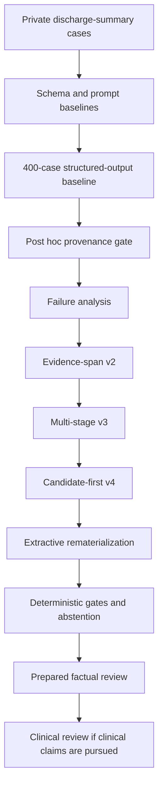
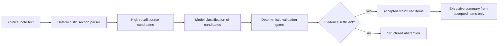
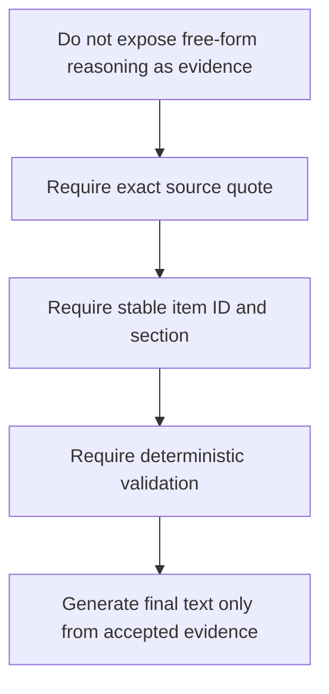

# HandoffLens scientific write-up

## Executive summary

HandoffLens is an engineering research project on source-grounded extraction from discharge-summary-style clinical text. The practical goal is to make LLM-generated handoff evidence auditable: every extracted item should be tied to an exact source quote, every summary should be derived from accepted evidence, and failures should be visible rather than silently converted into plausible clinical prose.

The current result is deliberately bounded. The project supports an engineering conclusion, not a clinical one: candidate-first extraction with deterministic provenance checks is more defensible than single-pass generation for this task because it makes unsupported claims, missing evidence, abstentions, cost, latency, and instability measurable. Human factual review and clinical validation remain pending.

## Dataset summary

The local study dataset contains 2,000 discharge-summary cases. As discussed during project design, the dataset appears to be extracted or derived from MIMIC-style discharge-summary data. MIMIC-IV-Note is a credentialed-access PhysioNet resource containing deidentified free-text clinical notes linked to MIMIC-IV; version 2.2 includes discharge summaries and radiology reports, with protected health information removed under HIPAA Safe Harbor procedures [1]. MIMIC-IV itself is a deidentified hospital and critical-care electronic health record dataset sourced from Beth Israel Deaconess Medical Center and organized into modular hospital and ICU tables [2].

No source notes, private cohorts, case-level model outputs, reviewer packets, API keys, or private labels are included in this public repository. The repository contains code, schemas, prompts, protocols, aggregate reports, synthetic fixtures, and documentation. This matters because derived MIMIC resources can still be sensitive and should not be treated as freely redistributable case text [2].

## Research questions

The experiment is designed around five engineering research questions:

1. Can structured-output LLM extraction from long clinical notes be made source-grounded enough for systematic audit?
2. Do deterministic evidence and provenance gates expose failures that schema validation alone misses?
3. Does a candidate-first pipeline reduce vacuous outputs, unsupported summaries, and source-quote failures compared with direct generation?
4. Can LLM-as-judge workflows provide useful proxy evaluation without being confused for ground truth?
5. What additional human review is required before making clinical claims about correctness, harmfulness, or usefulness?

## Experiment overview

The initial 400-case engineering run tested structured output under several configurations. JSON/schema completion was much better than source grounding: many outputs that looked structurally valid failed post hoc provenance checks because selected quotes could not be verified exactly in the source. This is the central negative result of the project: schema compliance is not the same thing as evidence fidelity.

The evidence-span v2 design then moved toward stricter source pointers. The multi-stage v3 pipeline was tested and rejected because it increased complexity without sufficient stability. Candidate-first v4 became the current strongest engineering direction: deterministic section/candidate discovery first, model classification second, deterministic materialization last.

## Current architecture

The key design choice is to restrict generation. The model is not asked to freely summarize the whole note. It is asked to classify or organize candidate evidence, while deterministic code preserves source quotes, identifiers, and section provenance. This is less glamorous than a single clever prompt, but scientifically much cleaner.

After critique of the original lexical-provenance framing, the audit layer now treats provenance as typed rather than monolithic. Evidence can be classified as direct quotation, supported normalization, inferential support, unsupported, or assertion-conflicting. This matters because exact substring containment is necessary but not sufficient: a quote can be present while the surrounding source states the item is absent, possible, conditional, historical, or associated with someone else.

The latest public extraction schema also adds a source-grounded `handoff_atoms` layer. Atoms preserve action, target, timing, threshold, owner, instruction kind, safety type, derived views, rationale, and source quote before the item is projected into compatibility fields such as `follow_up_actions` and `safety_flags`. The evaluator then runs deterministic atom/view canonicalization: source-quoted atoms can project into missing category fields, and source-quoted category items can backfill atoms. Reports show both raw-model F1 and post-canonicalization system F1 so model behavior is not confused with deterministic repair.

## Main findings so far

| Stage | What it tested | Result | Interpretation |
| --- | --- | --- | --- |
| 400-case structured-output baseline | Can an instruction model produce valid JSON-like extractions at scale? | High schema validity but poor post hoc quote provenance. | Structured output alone is insufficient. |
| Evidence-span v2 | Can stricter source spans improve grounding? | More conservative and more auditable. | Better scientific direction, but may miss items. |
| Multi-stage v3 | Can staged extraction/recovery improve robustness? | Rejected after development testing. | More calls did not automatically mean better evidence fidelity. |
| Candidate-first v4 | Can deterministic candidates plus model classification improve yield? | 19/20 final development cases passed deterministic gates, with one abstention. | Strongest current engineering architecture; over-extraction risk remains unresolved. |
| Extractive rematerialization | Can final labels and summaries avoid unsupported details? | Reduced proxy audit issues from 15/20 records to 3/20. | Final narrative text should be extractive or separately verified. |
| Assertion-aware and typed provenance | Can lexical provenance be separated from semantic assertion support? | Tooling implemented and covered by synthetic regression tests. | Enables run-level lexical-overstatement and typed-provenance reports; still proxy evidence until human review. |
| Handoff atoms and atom/view bridge | Can one source fact be represented once and projected into overlapping clinical views? | Implemented with raw-model versus system-score reporting. | Better diagnostic architecture, but two-case pilot scores are not clinical benchmarks. |
| Reviewer workflow | Can non-clinician factual review be prepared? | Prepared, not completed. | Suitable for source-entailment checks, not clinical severity. |

## Why LLM-as-judge is useful but not enough

LLM-as-judge evaluation is attractive because it scales and can provide structured error labels. Prior work shows that strong LLM judges can approximate human preference judgments in some settings, but also exhibit position, verbosity, and self-enhancement biases [3]. G-Eval similarly shows that LLM-based evaluation can correlate with human judgments for summarization tasks, while warning that LLM evaluators may favor LLM-generated text [4].

For HandoffLens, this means the judge is treated as a development proxy. It can help prioritize failures such as unsupported summary clauses, quote mismatch, or incomplete evidence. It cannot establish clinical correctness, harmfulness, safety, appropriateness, or patient outcome relevance.

## Prompting and reasoning choices

The project explored prompting and pipeline design rather than assuming that chain-of-thought alone would solve the task. Chain-of-thought prompting can improve complex reasoning performance in large models [5], but exposing or relying on free-form reasoning is not the central safety mechanism here. The safer pattern is private model deliberation plus public, structured evidence:

The scientific reason is simple: in clinical extraction, a beautiful explanation is less useful than a verifiable quote. Reasoning can help the model classify difficult candidates, but the repository should audit the observable output, not trust the model's internal rationale.

## Limitations

The limitations are substantial and should be stated plainly:

- The dataset cannot be redistributed in this repository.
- The current public artifact contains no private source records or case-level model outputs.
- The study has no true external validation cohort.
- The case records do not have usable dates or times, so temporal validation is not available.
- Human factual review is pending.
- Clinical review is pending and may not be available.
- Non-clinician reviewers can assess source support, quote completeness, and extraction consistency, but not clinical harmfulness or care appropriateness.
- LLM-as-judge results are proxy signals, not labels.
- Candidate-first v4's higher item yield should be interpreted through factual review to distinguish recovered evidence from over-extraction.
- The current atom/view pilot uses only two synthetic cases; pilot F1 is useful for regression testing and failure analysis, not performance ranking.

## Our claim today

Our defensible claim is:

> HandoffLens demonstrates a reproducible engineering framework for evaluating and improving source-grounded LLM extraction from discharge-summary-like clinical text. Across development iterations, schema-valid generation proved insufficient for evidence fidelity, while a candidate-first architecture with deterministic provenance gates made failure modes more measurable and created a practical path for targeted human review.

This project, in its current iteration, does not claim clinical safety, clinical accuracy, harmful-error reduction, deployment readiness, or generalization.

## References

[1] Johnson, A., Pollard, T., Horng, S., Celi, L. A., & Mark, R. (2023). *MIMIC-IV-Note: Deidentified free-text clinical notes* (version 2.2). PhysioNet. https://doi.org/10.13026/1n74-ne17

[2] Johnson, A., Bulgarelli, L., Pollard, T., Horng, S., Celi, L. A., & Mark, R. (2023). *MIMIC-IV* (version 2.2). PhysioNet. https://doi.org/10.13026/6mm1-ek67. See also: Johnson, A. E. W., Bulgarelli, L., Shen, L., et al. (2023). MIMIC-IV, a freely accessible electronic health record dataset. *Scientific Data*, 10, 1. https://doi.org/10.1038/s41597-022-01899-x

[3] Zheng, L., Chiang, W.-L., Sheng, Y., Zhuang, S., Wu, Z., Zhuang, Y., Lin, Z., Li, Z., Xing, E. P., Zhang, H., Gonzalez, J. E., & Stoica, I. (2023). Judging LLM-as-a-Judge with MT-Bench and Chatbot Arena. arXiv:2306.05685.

[4] Liu, Y., Iter, D., Xu, Y., Wang, S., Xu, R., & Zhu, C. (2023). G-Eval: NLG Evaluation using GPT-4 with Better Human Alignment. arXiv:2303.16634.

[5] Wei, J., Wang, X., Schuurmans, D., Bosma, M., Ichter, B., Xia, F., Chi, E., Le, Q., & Zhou, D. (2022). Chain-of-Thought Prompting Elicits Reasoning in Large Language Models. arXiv:2201.11903.

