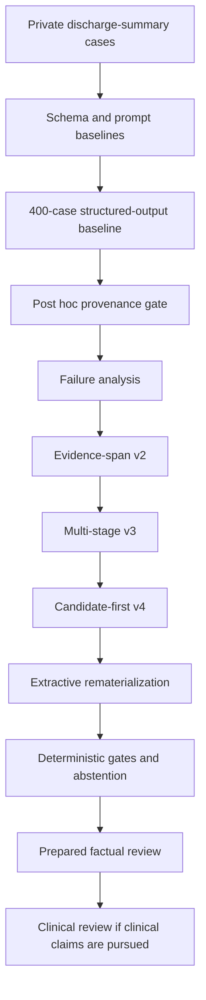
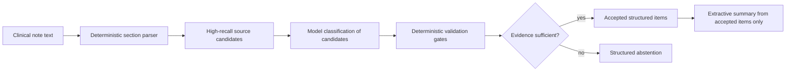
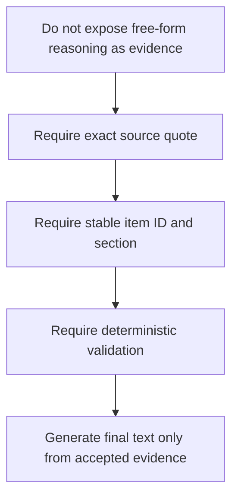

# HandoffLens scientific write-up

## Executive summary

HandoffLens is an engineering research project on source-grounded extraction from discharge-summary-style clinical text. The practical goal is to make LLM-generated handoff evidence auditable: every extracted item should be tied to an exact source quote, every summary should be derived from accepted evidence, and failures should be visible rather than silently converted into plausible clinical prose.

The current result is deliberately bounded. The project supports an engineering conclusion, not a clinical one: candidate-first extraction with deterministic provenance checks is more defensible than single-pass generation for this task because it makes unsupported claims, missing evidence, abstentions, cost, latency, and instability measurable. The strongest public benchmark-shaped result is the 207-row ACI-Bench Command A+ note run plus pre-specified compact attribution repair: repaired notes retain 91.2% of raw ROUGE-L while reducing unsupported-sentence case rate by 75.4 percentage points under a lexical source-support proxy. This is a repository-scorer diagnostic, not an official ACI-Bench leaderboard result. Human factual review, entailment-backed source support, official-scorer reproduction, and in-domain clinical validation remain pending.

## Dataset summary

The local study dataset contains 2,000 discharge-summary cases. As discussed during project design, the dataset appears to be extracted or derived from MIMIC-style discharge-summary data. MIMIC-IV-Note is a credentialed-access PhysioNet resource containing deidentified free-text clinical notes linked to MIMIC-IV; version 2.2 includes discharge summaries and radiology reports, with protected health information removed under HIPAA Safe Harbor procedures [1]. MIMIC-IV itself is a deidentified hospital and critical-care electronic health record dataset sourced from Beth Israel Deaconess Medical Center and organized into modular hospital and ICU tables [2].

No source notes, private cohorts, case-level model outputs, reviewer packets, API keys, or private labels are included in this public repository. The repository contains code, schemas, prompts, protocols, aggregate reports, synthetic fixtures, and documentation. This matters because derived MIMIC resources can still be sensitive and should not be treated as freely redistributable case text [2].

## Research questions

The experiment is designed around five engineering research questions:

1. Can structured-output LLM extraction from long clinical notes be made source-grounded enough for systematic audit?
2. Do deterministic evidence and provenance gates expose failures that schema validation alone misses?
3. Does a candidate-first pipeline reduce vacuous outputs, unsupported summaries, and source-quote failures compared with direct generation?
4. Can LLM-as-judge workflows provide useful proxy evaluation without being confused for ground truth?
5. What additional human review is required before making clinical claims about correctness, harmfulness, or usefulness?

## Experiment overview

```mermaid
flowchart TD
    A["Private discharge-summary cases"] --> B["Schema and prompt baselines"]
    B --> C["400-case structured-output baseline"]
    C --> D["Post hoc provenance gate"]
    D --> E["Failure analysis"]
    E --> F["Evidence-span v2"]
    F --> G["Multi-stage v3"]
    G --> H["Candidate-first v4"]
    H --> I["Extractive rematerialization"]
    I --> J["Deterministic gates and abstention"]
    J --> K["Prepared factual review"]
    K --> L["Clinical review if clinical claims are pursued"]
```

The initial 400-case engineering run tested structured output under several configurations. JSON/schema completion was much better than strict source grounding: many outputs that looked structurally valid failed post hoc provenance checks because selected quotes could not be verified exactly in the source. A later miss-taxonomy and deterministic span-ID recovery pass narrowed the interpretation: many exact-match failures appear to be quote-format, non-contiguous citation, or pointer-drift artifacts rather than direct evidence of fabrication. In the selected JSON-schema cell, item-level support improves from 54.4% exact-contiguous quotes to 82.9% span-supported items, while 37.5% of exact misses still abstain. The central negative result still holds, but it is more precise: schema compliance carried little information about auditable source anchoring.

Because the lowest-performing cases were also dense in extracted claims, HandoffLens added a decomposition stress diagnostic rather than claiming a broad causal length effect. The diagnostic selected 100 failed exact-provenance evidence items from each of three held-out Cohere cells and compared five support policies: exact full-note matching, normalized full-note matching, line-span retrieval, section-filtered retrieval, and clause-aware query retrieval with a bounded greedy token-union fallback plus assertion-cue guarding. Across 300 deliberately difficult items, exact matching supported 0, normalized full-note matching supported 35, line-span retrieval supported 55, section-filtered retrieval supported 41, and assertion-guarded clause-aware query retrieval supported 188. A coherence audit then separated those 188 supported items into 106 auto-accepted supports and 82 review-required supports, with 0 high-risk supported items and 112 abstentions. Full-note normalization consumed about 1,676 source words when it succeeded; targeted line and query-aware retrieval consumed about 9.2 and 22.3 words. The latest revision made assertion-cue guarding target-aware: broad cues such as "no", "not", "without", and uncertainty terms block support only when their local scope overlaps the extracted item target, with a narrow lab/procedure exception for negative test results or uncomplicated procedures. This recovered 21 items, but 16 of those new recoveries are review-required rather than auto-accepted. The design implication is not "long notes cause failure." It is narrower: many failures are recoverable by decomposing dense notes into auditable spans, but low-overlap items, remaining assertion conflicts, medium-risk stitching cases, and semantic-fidelity questions still need abstention, entailment scoring, or review.

This is aligned with recent long-context findings rather than based only on project intuition. "Lost in the Middle" shows that even long-context models can underuse evidence depending on where it appears inside the prompt [10], and later positional-bias work argues that relevance can be distorted by context position rather than semantic importance alone [11]. Recent long-context RAG baseline work also cautions that added pipeline complexity should be tested against simple structure-preserving retrieval under matched token budgets [12]. For HandoffLens, that means the safest near-term design test is not a larger prompt window. It is query-aware evidence selection plus conservative abstention when selected spans are too diffuse, assertion-conflicting, or only weakly overlapping.

The evidence-span v2 design then moved toward stricter source pointers. The multi-stage v3 pipeline was tested and rejected because it increased complexity without sufficient stability. Candidate-first v4 became the current strongest engineering direction: deterministic section/candidate discovery first, model classification second, deterministic materialization last.

## Current architecture

```mermaid
flowchart LR
    A["Clinical note text"] --> B["Deterministic section parser"]
    B --> C["High-recall source candidates"]
    C --> D["Model classification of candidates"]
    D --> E["Deterministic validation gates"]
    E --> F{"Evidence sufficient?"}
    F -- "yes" --> G["Accepted structured items"]
    F -- "no" --> H["Structured abstention"]
    G --> I["Extractive summary from accepted items only"]
```

The key design choice is to restrict generation. The model is not asked to freely summarize the whole note. It is asked to classify or organize candidate evidence, while deterministic code preserves source quotes, identifiers, and section provenance. This is less glamorous than a single clever prompt, but scientifically much cleaner.

This direction is also consistent with recent clinical NLP work. CLEAR reports that entity-aware retrieval can outperform embedding RAG and full-note prompting while using fewer tokens [6]. CLINES, a recent preprint, uses semantic chunking, extraction, normalization, date handling, and cross-chunk aggregation, while still emphasizing manual review for residual hallucination [7]. FactEHR frames clinical factuality around fact decomposition and entailment pairs, showing why source support should eventually move beyond lexical span checks [8]. Earlier clinical sectioning work also supports treating section detection as a first-class preprocessing problem rather than an afterthought [9].

After critique of the original lexical-provenance framing, the audit layer now treats provenance as typed rather than monolithic. Evidence can be classified as direct quotation, supported normalization, inferential support, unsupported, or assertion-conflicting. This matters because exact substring containment is necessary but not sufficient: a quote can be present while the surrounding source states the item is absent, possible, conditional, historical, or associated with someone else.

The latest public extraction schema also adds a source-grounded `handoff_atoms` layer. Atoms preserve action, target, timing, threshold, owner, instruction kind, safety type, derived views, rationale, and source quote before the item is projected into compatibility fields such as `follow_up_actions` and `safety_flags`. The evaluator then runs deterministic atom/view canonicalization: source-quoted atoms can project into missing category fields, and source-quoted category items can backfill atoms. Reports show both raw-model F1 and post-canonicalization system F1 so model behavior is not confused with deterministic repair.

## Main findings so far

| Stage | What it tested | Result | Interpretation |
| --- | --- | --- | --- |
| 400-case structured-output baseline | Can an instruction model produce valid JSON-like extractions at scale? | High schema validity but poor strict quote provenance; span-ID recovery improves item-level auditability while leaving many abstentions. | Structured output alone is insufficient, and exact-span failure should not be reported as hallucination without review or entailment scoring. |
| Decomposition stress diagnostic | Do parsing/chunking policies help on the lowest exact-provenance items? | Assertion-guarded clause-aware query retrieval supported 188/300 worst selected items; coherence audit split these into 106 auto-accepted and 82 review-required supports, with 112 abstentions and 0 high-risk supported items. | Parsing helps the recoverable subset with far less context, but the latest gains mostly increase review-required support rather than automatic acceptance. |
| Evidence-span v2 | Can stricter source spans improve grounding? | More conservative and more auditable. | Better scientific direction, but may miss items. |
| Multi-stage v3 | Can staged extraction/recovery improve robustness? | Rejected after development testing. | More calls did not automatically mean better evidence fidelity. |
| Candidate-first v4 | Can deterministic candidates plus model classification improve yield? | 19/20 final development cases passed deterministic gates, with one abstention. | Strongest current engineering architecture; over-extraction risk remains unresolved. |
| Extractive rematerialization | Can final labels and summaries avoid unsupported details? | Reduced proxy audit issues from 15/20 records to 3/20. | Final narrative text should be extractive or separately verified. |
| Assertion-aware and typed provenance | Can lexical provenance be separated from semantic assertion support? | Tooling implemented and covered by synthetic regression tests. | Enables run-level lexical-overstatement and typed-provenance reports; still proxy evidence until human review. |
| Handoff atoms and atom/view bridge | Can one source fact be represented once and projected into overlapping clinical views? | Implemented with raw-model versus system-score reporting. | Better diagnostic architecture, but two-case pilot scores are not clinical benchmarks. |
| ACI-Bench Command A+ and repair | Can model-generated notes beat simple extractive baselines while preserving auditable source support? | Command A+ beat compressed extractive baselines under the repository scorer; pre-specified compact repair retained most ROUGE-L and reduced unsupported-sentence flags. | Strong public benchmark-shaped result, but not leaderboard-comparable without official-scorer reproduction, and lexical support is not semantic entailment. |
| BioScope assertion benchmark | Can the assertion layer be compared to transparent baselines? | Hybrid assertion detector matched the ConText-style cue comparator on the collapsed sentence-level task. | Adjacent-domain cue validation; target-aware item-quote behavior remains unmeasured on clinical notes. |
| Reviewer workflow | Can non-clinician factual review be prepared? | Prepared, not completed. | Suitable for source-entailment checks, not clinical severity. |

## Why LLM-as-judge is useful but not enough

LLM-as-judge evaluation is attractive because it scales and can provide structured error labels. Prior work shows that strong LLM judges can approximate human preference judgments in some settings, but also exhibit position, verbosity, and self-enhancement biases [3]. G-Eval similarly shows that LLM-based evaluation can correlate with human judgments for summarization tasks, while warning that LLM evaluators may favor LLM-generated text [4].

For HandoffLens, this means the judge is treated as a development proxy. It can help prioritize failures such as unsupported summary clauses, quote mismatch, or incomplete evidence. It cannot establish clinical correctness, harmfulness, safety, appropriateness, or patient outcome relevance.

## Prompting and reasoning choices

The project explored prompting and pipeline design rather than assuming that chain-of-thought alone would solve the task. Chain-of-thought prompting can improve complex reasoning performance in large models [5], but exposing or relying on free-form reasoning is not the central safety mechanism here. The safer pattern is private model deliberation plus public, structured evidence:

```mermaid
flowchart TD
    A["Do not expose free-form reasoning as evidence"] --> B["Require exact source quote"]
    B --> C["Require stable item ID and section"]
    C --> D["Require deterministic validation"]
    D --> E["Generate final text only from accepted evidence"]
```

The scientific reason is simple: in clinical extraction, a beautiful explanation is less useful than a verifiable quote. Reasoning can help the model classify difficult candidates, but the repository should audit the observable output, not trust the model's internal rationale.

## Limitations

The limitations are substantial and should be stated plainly:

- The dataset cannot be redistributed in this repository.
- The current public artifact contains no private source records or case-level model outputs.
- The study has no true external validation cohort.
- The case records do not have usable dates or times, so temporal validation is not available.
- Human factual review is pending.
- Clinical review is pending and may not be available.
- Non-clinician reviewers can assess source support, quote completeness, and extraction consistency, but not clinical harmfulness or care appropriateness.
- LLM-as-judge results are proxy signals, not labels.
- Candidate-first v4's higher item yield should be interpreted through factual review to distinguish recovered evidence from over-extraction.
- The current atom/view pilot uses only two synthetic cases; pilot F1 is useful for regression testing and failure analysis, not performance ranking.
- ACI source-support repair is currently evaluated with lexical overlap and unsupported-sentence proxies, not semantic entailment.
- ACI ROUGE values are repository-scorer diagnostics and should not be compared directly to published full-note scores until official preprocessing, scorer, split handling, and baseline sanity checks are reproduced.
- BioScope public text is biomedical literature, not clinical notes; the clinical XML is redacted and not a valid clinical assertion benchmark.
- The decomposition stress diagnostic is selected from the worst exact-provenance items. It is a targeted failure-analysis experiment, not a population estimate or proof that note length causally drives errors.

## Highest-value remaining validation

The next evidence step is not more framework design. It is measurement:

1. Entailment-backed source support on ACI generated and repaired notes. A factuality or NLI-style scorer such as MiniCheck, AlignScore, or a clinical NLI model should be run over claim/source pairs, with a small human disagreement read. This would test whether compact repair improves semantic faithfulness, not only lexical overlap.
2. In-domain clinical assertion validation. The target-aware item-quote checks should be measured on clinical-note text through DUA-controlled i2b2/n2c2 data or a private adjudicated clinical gold set. Until then, BioScope remains adjacent-domain component evidence.

## Our claim today

Our defensible claim is:

> HandoffLens demonstrates a reproducible engineering framework for evaluating and improving source-grounded LLM extraction from discharge-summary-like clinical text. Across development iterations, schema-valid generation proved insufficient for evidence fidelity, while a candidate-first architecture with deterministic provenance gates made failure modes more measurable and created a practical path for targeted human review.

This project, in its current iteration, does not claim clinical safety, clinical accuracy, harmful-error reduction, deployment readiness, or generalization.

## References

[1] Johnson, A., Pollard, T., Horng, S., Celi, L. A., & Mark, R. (2023). *MIMIC-IV-Note: Deidentified free-text clinical notes* (version 2.2). PhysioNet. https://doi.org/10.13026/1n74-ne17

[2] Johnson, A., Bulgarelli, L., Pollard, T., Horng, S., Celi, L. A., & Mark, R. (2023). *MIMIC-IV* (version 2.2). PhysioNet. https://doi.org/10.13026/6mm1-ek67. See also: Johnson, A. E. W., Bulgarelli, L., Shen, L., et al. (2023). MIMIC-IV, a freely accessible electronic health record dataset. *Scientific Data*, 10, 1. https://doi.org/10.1038/s41597-022-01899-x

[3] Zheng, L., Chiang, W.-L., Sheng, Y., Zhuang, S., Wu, Z., Zhuang, Y., Lin, Z., Li, Z., Xing, E. P., Zhang, H., Gonzalez, J. E., & Stoica, I. (2023). Judging LLM-as-a-Judge with MT-Bench and Chatbot Arena. arXiv:2306.05685.

[4] Liu, Y., Iter, D., Xu, Y., Wang, S., Xu, R., & Zhu, C. (2023). G-Eval: NLG Evaluation using GPT-4 with Better Human Alignment. arXiv:2303.16634.

[5] Wei, J., Wang, X., Schuurmans, D., Bosma, M., Ichter, B., Xia, F., Chi, E., Le, Q., & Zhou, D. (2022). Chain-of-Thought Prompting Elicits Reasoning in Large Language Models. arXiv:2201.11903.

[6] Lopez, I., Swaminathan, A., Vedula, K., et al. (2025). Clinical entity augmented retrieval for clinical information extraction. *npj Digital Medicine*, 8, 45. https://doi.org/10.1038/s41746-024-01377-1

[7] CLINES: Clinical LLM-based Information Extraction and Structuring Agent. medRxiv preprint. https://www.medrxiv.org/content/10.64898/2025.12.01.25341355v2

[8] Munnangi, M., Swaminathan, A., Fries, J. A., et al. (2025). FactEHR: A Dataset for Evaluating Factuality in Clinical Notes Using LLMs. *Proceedings of Machine Learning Research*, 298. https://proceedings.mlr.press/v298/munnangi25a.html

[9] Zhang, F., Laish, I., Benjamini, A., & Feder, A. (2022). Section Classification in Clinical Notes with Multi-task Transformers. *Proceedings of LOUHI*. https://aclanthology.org/2022.louhi-1.7/

[10] Liu, N. F., Lin, K., Hewitt, J., Paranjape, A., Bevilacqua, M., Petroni, F., & Liang, P. (2024). Lost in the Middle: How Language Models Use Long Contexts. *Transactions of the Association for Computational Linguistics*, 12, 157-173. https://aclanthology.org/2024.tacl-1.9/

[11] Hsieh, C.-Y., Chuang, Y.-S., Li, C.-L., Wang, Z., Le, L., Kumar, A., Glass, J., Ratner, A., Lee, C.-Y., Krishna, R., & Pfister, T. (2024). Found in the Middle: Calibrating Positional Attention Bias Improves Long Context Utilization. *Findings of ACL 2024*. https://aclanthology.org/2024.findings-acl.890/

[12] Laitenberger, A., Manning, C. D., & Liu, N. F. (2025). Stronger Baselines for Retrieval-Augmented Generation with Long-Context Language Models. *EMNLP 2025*. https://aclanthology.org/2025.emnlp-main.1656/

